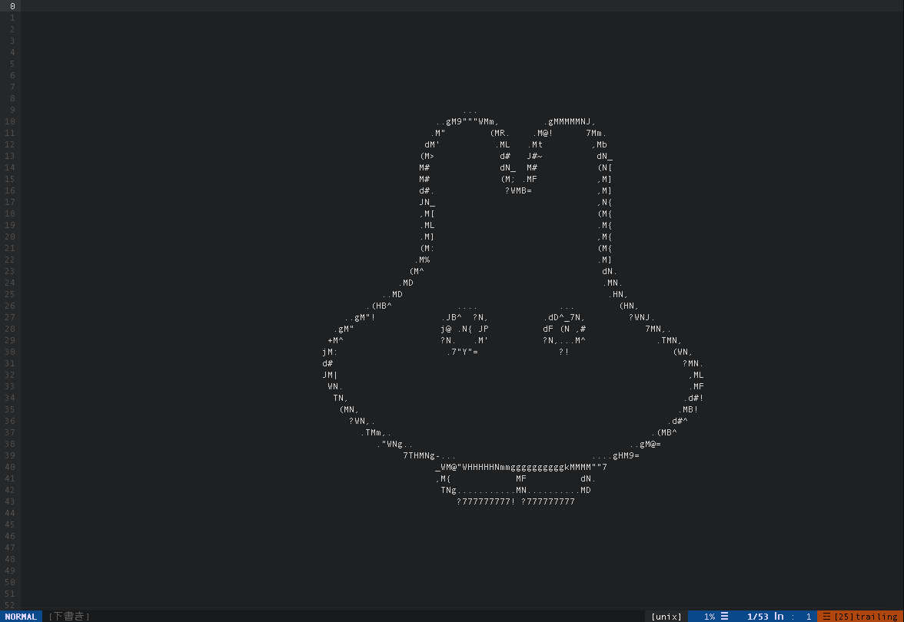
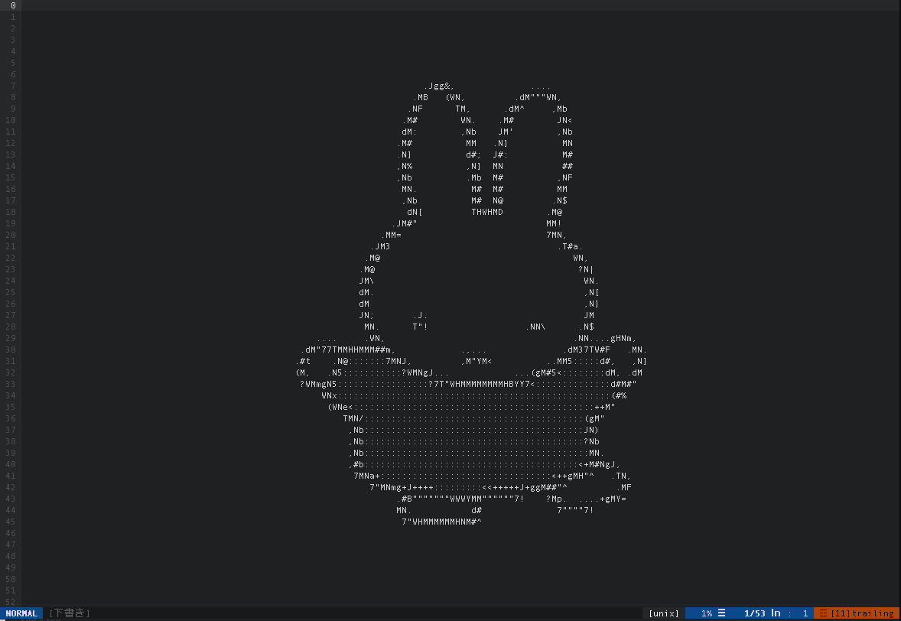

# splash-miffy
vim-splashでvim起動時にミッフィーを表示しよう!

## スクリーンショット
- ghost-miffy

- normal-miffy


## 使い方
1. vim-splashをインストール (https://github.com/thinca/vim-splash)
2. ghost-miffy.txt,normal-miffy.txtを適当な場所に置き、.vimrcを以下を追記
```vim
" ghost-miffy.txtの場合
let g:splash#path="path/to/ghost-miffy.txt"
" normal-miffy.txtの場合
let g:splash#path="path/to/normal-miffy.txt"
```

## 使用させてもらったサイト
- 画像をAAに変化するサービス : https://tool-taro.com/image_to_ascii/
